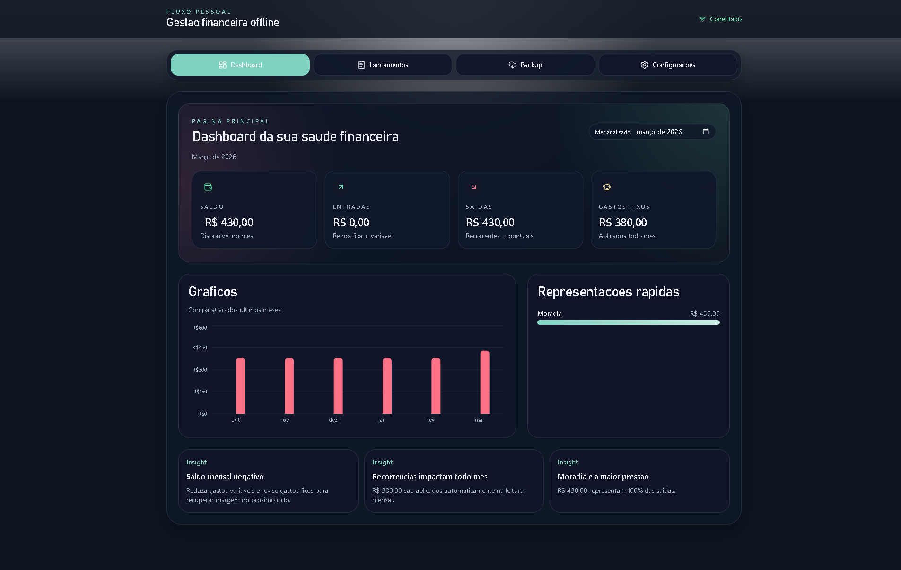

<p align="center">
  
</p>

<h1 align="center">Fluxo Pessoal</h1>

<p align="center">
  Aplicativo de controle financeiro pessoal — offline-first, responsivo e com dados armazenados localmente no navegador.
</p>

---

## Screenshots

<table>
  <tr>
    <th align="center">Desktop</th>
    <th align="center">Mobile</th>
  </tr>
  <tr>
    <td align="center">
      
    </td>
    <td align="center">
      
    </td>
  </tr>
</table>

---

## Visão Geral

**Fluxo Pessoal** é uma Progressive Web App (PWA) construída com React, TypeScript e Vite que permite gerenciar entradas, saídas e gastos recorrentes sem depender de servidores externos. Todos os dados são persistidos localmente via IndexedDB através do Dexie, com reatividade em tempo real por meio do `useLiveQuery`.

---

## Funcionalidades

| Página | Descrição |
|--------|-----------|
| **Dashboard** | Visão consolidada da saúde financeira: saldo, entradas, saídas, gastos fixos, gráfico comparativo dos últimos 6 meses, distribuição por categoria e insights automáticos. |
| **Lançamentos** | Registro de gastos e entradas com categoria, valor, data, observação e opção de marcar como **gasto fixo mensal (recorrente)**. Histórico filtrável por tipo. |
| **Backup** | Exportação e importação de todos os dados em JSON. Exclusão completa de todos os registros locais. |
| **Configurações** | Troca de tema (claro/escuro), ajuste de renda fixa mensal e status de conectividade. |

---

## Regras de Negócio

- **Gastos recorrentes:** ao marcar um lançamento como fixo mensal, ele é considerado automaticamente em todos os meses na projeção de saúde financeira.
- **Exclusão em cascata:** ao remover um lançamento incorreto da tabela `transactions`, registros relacionados em `fixedExpenses` e `budgets` também são removidos atomicamente.
- **Limpeza total:** o botão "Apagar todos os dados" remove registros de todas as tabelas (`settings`, `transactions`, `fixedExpenses`, `budgets`) em uma única transação.
- **Atualização reativa:** qualquer alteração nas tabelas reflete imediatamente em saldo, saídas, métricas e gráficos via `useLiveQuery`.

---

## Stack Técnica

| Tecnologia | Papel |
|------------|-------|
| [React 19](https://react.dev) | Interface e gerenciamento de estado |
| [TypeScript](https://www.typescriptlang.org) | Tipagem estática |
| [Vite 8](https://vite.dev) | Dev server e bundler |
| [Dexie 4](https://dexie.org) + [dexie-react-hooks](https://dexie.org/docs/dexie-react-hooks/useLiveQuery()) | Banco IndexedDB com reatividade |
| [Tailwind CSS 4](https://tailwindcss.com) | Estilização utilitária |
| [Recharts](https://recharts.org) | Gráficos |
| [Lucide React](https://lucide.dev) | Ícones |
| Service Worker | Cache offline e PWA |

---

## Instalação e Execução

**Pré-requisitos:** Node.js 20+

```bash
# Instalar dependências
npm install

# Iniciar servidor de desenvolvimento
npm run dev

# Gerar build de produção
npm run build

# Pré-visualizar o build
npm run preview

# Verificar qualidade do código
npm run lint
```

---

## Estrutura do Projeto

```
src/
├── assets/
│   └── logo.png             # Ícone do aplicativo
├── components/
│   └── MonthlyChart.tsx     # Gráfico de barras mensal
├── lib/
│   └── db.ts                # Schema Dexie e helpers de banco
├── pages/
│   ├── DashboardPage.tsx    # Página principal com métricas
│   ├── EntriesPage.tsx      # Cadastro e histórico de lançamentos
│   ├── BackupPage.tsx       # Exportação, importação e limpeza
│   └── SettingsPage.tsx     # Tema, renda fixa e status offline
├── App.tsx                  # Roteamento, estado global e lógica
├── main.tsx                 # Ponto de entrada e registro do SW
└── index.css                # Variáveis de tema, utilitários e animações

public/
├── sw.js                    # Service Worker (cache offline)
└── manifest.webmanifest     # Manifesto PWA
```

---

## Offline e PWA

O app funciona completamente sem conexão após a primeira visita:

- O Service Worker em `public/sw.js` armazena em cache o shell da aplicação (HTML, JS, CSS) e os demais assets estáticos.
- Os dados do usuário são persistidos no IndexedDB do navegador — independentes de rede.
- O app pode ser instalado como PWA em dispositivos móveis e desktops diretamente pelo navegador.

---

## Licença

Distribuído para uso pessoal. Todos os direitos reservados.
